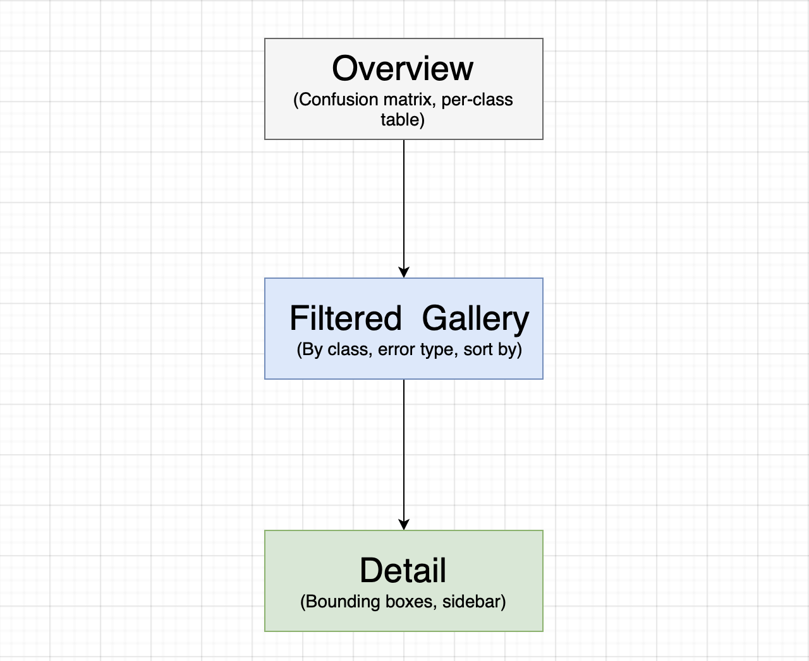

# Validation Explorer -- Ultralytics Platform Prototype
This prototype demonstrates the image-drilldown layer that sits underneath the existing validation dashboard, allowing a user to inspect individual images that weren't performing as well as they expect on certain metrics. This layer also empowers a user to discover potential patterns from failing cases, thus providing actionable insights into how to improve model performance on later iterations.

## Setup
```bash
# 1. Install Python dependencies into a virtual environment.
pipenv install -r requirements.txt

# 2. Generate fixtures.
python run scripts/generate_mock_data.py

# 3. Install Node dependencies and start the app.
npm install
npm run dev
```

Open [http://localhost:3000](http://localhost:3000) in a browser. This lands on an overview page of validation run.

## The drilldown workflow

The three pages form one continuous funnel:
 

Every entry poinnt -- a confusion matrix cell, a per-class table row, a pattern group card -- lands in the same filtered gallery.

## Frontend Architecture

```
Browser
  └── Pages (Next.js server components)
        ├── app/runs/[runId]/page.tsx          Overview
        ├── app/runs/[runId]/images/page.tsx   Gallery
        ├── app/runs/[runId]/images/[id]/...   Detail
        └── app/runs/[runId]/patterns/page.tsx Patterns
              │
              │  direct function call (no HTTP)
              ▼
        lib/store.ts                    Data logic — filter, sort, group
              │
              ▼
        data/fixtures/*.json            COCO128 GT + simulated predictions
 
  Three "use client" components are separated from pages as they can't import server-side modules:
    ConfusionMatrix.tsx   — cell clicks navigate to filtered gallery
    FilterBar.tsx         — dropdowns update URL via router.push()
    BoxOverlay.tsx        — SVG box rendering with hover interaction
 
  app/api/runs/[runId]/.../route.ts     — HTTP contract for external consumers
```

**URL is the filter state.** Filter changes are navigations, not React state updates. This means filtered views are shareable links, the browser back button works through the entire drilldown, and clicking a confusion matrix cell is identical to typing a filter — both just change the URL.


## Product and UX decisions
- **Server-side data retrieval**. Scripts in `app/api` defines the HTTP contract for external consumers and client components. All pages in `api/runs` are server components that directly fetch JSON data through `lib/store.ts` stored in local disk. This allows for one-command launch, end-to-end type safety and separation of concerns without unnecessary maintenance burnden.
- **Worst-first default**. The gallery sorts by per-image F1 ascending. A reviewer opening the gallery immediately sees the most broken images, not a random sample. The sort is overridable. Note per-class table sorts by mAP50 ascending -- the class that the model struggles the most appeares at the top. The sorting critieria is not overridable.
- **Dominant error type as a first-class signal.** Each image carries a `dominantErrorType` — whichever failure mode appeared most (false negative, localization, classification, false positive). This single field powers the gallery filter, the pattern grouping, and the badge on each card, making it the consistent vocabulary across all three screens.
- **Pattern discovery through clustering.** The patterns view groups by class, error type, or confidence band — three dimensions that answer different questions without requiring any additional inference. The result is a ranked list of failure clusters (e.g. "28 images where false negatives dominate, average F1 of 0.41") with representative thumbnails and links to the full filtered gallery.
- **Confusion matrix as a navigation element.** Each cell is clickable and navigates to the gallery filtered by that true/predicted class pair. The matrix is not just a read-only chart — it is the primary drilldown entry point from the overview.

## Data model

This demo leverages a subset of COCO128 dataset from Ultralytics. A total of 11 classes amomg all 80 are used to keep confusion matrix readable. Images that contain none of these classes are skipped.
 
Furthermore, all bounding boxes use normalised YOLO `[cx, cy, w, h]` format — values in `[0, 1]` relative to image dimensions. Normalized coordinates are converted to SVG pixel values before rendering. The use of SVG `<rect>` element over HTML `<canvas>` is intentional as it makes hover interaction -- `onMouseEnter` straighforward to attach.
 
**Five error types** form the diagnostic vocabulary of the entire prototype:
 
| Type | Definition |
|---|---|
| `false_positive` | Predicted box with no matching GT |
| `false_negative` | GT object with no matching prediction |
| `localization` | Right class, IoU < 0.5 |
| `classification` | Right location, wrong class |
| `duplicate` | Redundant prediction suppressed by NMS |
 
Each `Detection` and `GroundTruth` carries cross-reference IDs (`groundTruthId`, `matchedPredictionId`, `nearestPredictionId`) so the detail view can draw both layers and link them on hover without additional requests.
 
Per-image quality is measured as the Sørensen–Dice coefficient: `2TP / (2TP + FP + FN)`. This gives a single number in [0, 1] that drives the worst-first sort and the score bar on each card.

## What is real vs simulated
 
| Layer | Source | Status |
|---|---|---|
| Images | Real COCO128 photos (`public/images/`) | ✅ Real |
| Ground truth boxes | Real YOLO `.txt` label files | ✅ Real |
| Aggregate metrics (mAP, P, R, F1) | Derived from simulated detections | 🟡 Approximated |
| Per-image summary (TP/FP/FN) | Derived from simulated detections | 🟡 Approximated |
| Prediction boxes | Simulated via difficulty profiles | 🔴 Simulated |
| Error type classification | Real IoU matching on simulated boxes | 🟡 Hybrid |
| Confusion matrix | Derived from simulated misclassifications | 🟡 Approximated |

The ground truth annotations are real. The predictions are not — they are generated by a per-class difficulty profile that produces a realistic distribution of failure modes without running a real model.
 
**What the generator simulates:** `model.predict()` per image + IoU matching + error type classification. It does not simulate `model.val()` — aggregate metrics are derived from the simulated detections rather than from a real validation run.

## API contract
 
Four endpoints, all returning the same schema the frontend types describe:
 
```
GET /api/runs/:runId/summary
    → ValidationRun: aggregate metrics, per-class metrics, confusion matrix
 
GET /api/runs/:runId/images?class=&errorType=&confMin=&confMax=&sort=&page=
    → ImageListResponse: paginated ImageListItem[] (no prediction arrays)
 
GET /api/runs/:runId/patterns?groupBy=class|errorType|confidence
    → PatternsResponse: ranked PatternGroup[] with representative image IDs
 
GET /api/images/:imageId
    → ImageDetailResponse: full ImageResult with predictions and ground truths
```
 
`types/validation.ts` (TypeScript) and `backend/models.py` (Pydantic v2) both describe this contract. In production, a FastAPI service would implement these endpoints with the same response shapes — the frontend would not change.

## What Ultralytics already provides vs what this prototype adds

**Layer 1 — Dataset-level aggregate metrics** ✅ Fully provided by `model.val()`
 
```python
results = model.val(data="coco8.yaml")
results.box.map50        # overall mAP50
results.box.maps         # per-class mAP50-95 list
results.box.mp           # mean precision
results.box.mr           # mean recall
results.confusion_matrix # NxN matrix
```
This is what the Ultralytics Platform already shows today. The overview screen's metric cards, per-class table, and confusion matrix are all sourced from Layer 1.

**Layer 2 — Per-image summary counts** ✅ Provided by `results.box.image_metrics`
 
```python
results.box.image_metrics
# → {"path/to/img.jpg": {"tp": 3, "fp": 1, "fn": 2, "f1": 0.75, ...}}
```
 
Per-image precision, recall, F1, TP, FP, and FN at IoU=0.5. This gives the gallery's score bar, the TP/FP/FN counts on each card, and the worst-first sort. The Ultralytics Platform does not currently surface this — it is the first gap this prototype fills.

**Layer 3 — Per-box detail** ❌ Not provided by `model.val()`
 
`image_metrics` gives counts but no bounding box coordinates, no per-detection confidence scores, and no error type classification. There is no built-in way to know *which specific predictions* produced those counts, where those boxes are in the image, or whether a given failure was a localisation error vs a classification error vs a missed detection entirely.
 
Getting Layer 3 requires three additional steps that the Ultralytics package does not perform:
 
```python
# Step 1 — run inference per image to get real prediction boxes
preds = model.predict(img_path, conf=0.001, verbose=False)
pred_boxes = preds[0].boxes   # .xyxyn, .cls, .conf
 
# Step 2 — load ground truth from the YOLO .txt label file
gt_boxes = parse_yolo_labels(img_path)
 
# Step 3 — IoU matching to assign each prediction an error type
for pred, gt, iou_val in match_boxes(pred_boxes, gt_boxes, iou_thresh=0.5):
    error_type = classify_error(pred, gt, iou_val)
    # → "false_positive" | "false_negative" | "localization" | "classification"
```

This is what `generate_image` simulates. Instead of calling `model.predict()`, it calls `jitter_bbox()` and `displace_bbox()` to produce plausible prediction boxes seeded from the real GT coordinates. Instead of computing real IoU between a real model's outputs and real GT, it uses probability profiles (`base_recall`, `base_precision`) to decide what kind of error each detection represents. The `compute_iou()` function and the error taxonomy are already implemented and match what a real integration would use — the simulation is a placeholder for the model call only.
 
The detail view's box overlay, the error type badges, the pattern discovery grouping, and the confusion matrix drilldown are all powered by Layer 3 data. They are the second gap this prototype fills — and the one with no Ultralytics API equivalent today.

## How this connects to a real production system
 
Four substitutions, nothing else changes:

**GT source** — `load_coco128_images()` is replaced by a query against your dataset registry or MongoDB annotations collection. The returned shape stays identical;

**Predictions** — The `jitter_bbox` / `displace_bbox` simulation inside `generate_image()` is replaced by `model.predict()` calls (Layer 3). Layers 1 and 2 come from `model.val()` directly and slot into the existing `ValidationRun` and `ImageListItem` schemas without modification.
 
**Storage** — The three `json.dumps(...)` calls in `main()` become `db.runs.insert_one(run)` and `db.images.insert_many(images)`. The `images_index.json` file is replaced by a MongoDB projection that excludes `predictions` and `groundTruths`.
 
**`lib/store.ts`** — The four public functions (`getRun`, `getImageDetail`, `queryImages`, `getPatterns`) keep their signatures. Their internals change from `fs.readFileSync` to `await db.collection(...).find(...)`. Every route handler and every page component remains unchanged.


## What I'd build next
 
**Real model inference.** The generator has a `build_from_real_model()` stub that shows the production path. Wiring it up — running `model.predict()` over the val split and matching predictions to GT labels using the existing `compute_iou()` function — is the most important next step.
 
**Image-to-image navigation in the detail view.** The detail page currently has no prev/next controls. Adding them requires passing the ordered image IDs from the gallery into the detail URL, which is a small change to `ImageCard` and the detail page.
 
**Confidence histogram filter.** The `confMin`/`confMax` filter exists in the API and store but the `FilterBar` exposes only a dropdown. A range slider over the per-image average confidence distribution would make the "show me images where the model was uncertain" query more discoverable.
 
**Thumbnail generation.** The pattern cards use the `imageUrl` directly as a thumbnail, which loads full-size images at small display sizes. A real implementation would generate 200×150 thumbnails at fixture-generation time and store them alongside the originals.
 
**Multi-run comparison.** The current schema is one run at a time. The store's `getRun(runId)` function and the route structure already support multiple runs — the only missing piece is a runs-list page at `/` and a UI for selecting which run to view.
